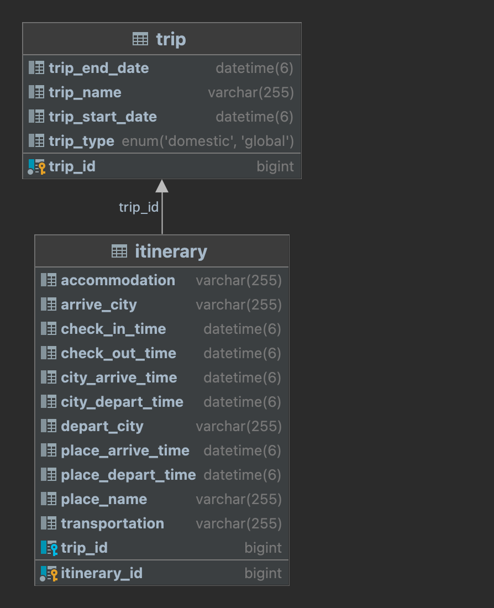

# 토이 프로젝트2 : 여행 여정을 기록과 관리하는 SNS 서비스 2단계
작성자 : 전유림, 차동민
## 🖥 프로젝트 개요
> 1. 프로젝트 주제 :  여행 여정을 기록과 관리하는 SNS 서비스 2단계
> 2. 프로젝트 기간 : 10월 23일(월) ~ 10월 27일(금) + 주말
> 3. 주요 목표 : Spring Boot, DB 설계, DB 트랜잭션, RESTful API 설계

## 👨‍👦‍👦 팀 소개

### 👤 조장 
| 이름  | 역할       |
|-----|----------|
| 정혜민 | 깃허브 프로젝트 구성, AWS RDS 설정, 여행 및 여정 Delete|

### 👥‍ 팀원
| 이름  | 역할       |
|-----|----------|
| 김동준 | Swagger 설정, 여행 Create|
| 김수빈 | PR 템플릿 설정, 여정 Create|
| 전유림 | 여행 Read, 여정 Update, 여정 Delete|
| 차동민 | 여행 Update|


## ⚙️ Project Settings
> 1. Java 버전 : 17
> 2. 빌드 & 빌드 도구 : Gradle
> 3. Git 브랜치 전략 : Feature Branch → Develop Branch → Main Branch

## 🛠️ Tech Stacks
> 1. Framework : SpringBoot
> 2. Database 및 ORM 설정 : MySQL, JPA
> 3. Database 배포 : Amazon RDS
> 4. API 문서화 설정 : Swagger
> 5. API 요청 테스트 도구 : Postman

## ⭐ GitHub Issue 및 Project 활용


## 📌  사전 공통 협의 사항
### 컨벤션
> 1. 코드 컨벤션 : Google Java 컨벤션 적용<br>
      https://programmer-ririhan.tistory.com/337
> 2. 커밋 컨벤션 : 공통된 커밋 템플릿 사용 <br>
     https://kdjun97.github.io/git-github/commit-convention/
> 3. PR 컨벤션 : 공통된 PR 템플릿 사용<br>
https://github.com/FC-BE-ToyProject-Team3/KDT_Y_BE_Toy_Project2/blob/main/.github/pull_request_template.md


### 개발
> 1. RFP 달성목표에는 '일정 정보에 위치 정보를 확인 및 추가하는 공통 유틸리티 클래스를 제공'하라고 명시되어 있지만, 각 Domain(Trip, Itinerary)에 이미 여정 별 위치정보(Place name)를 확인 및 추가할 수 있는 기능이 구현되어 있기 때문에 공통 유틸리티 클래스는 정의하지 않음 <br>
     → 여행 조회 기능을 통해 각 여행에 속해있는 여정의 위치정보(Place name)를 조회할 수 있음.<br>
     → 여정 수정 기능을 통해 각 여정 별 ID를 식별자로 사용하여 특정 여정에 대한 위치정보(Place name)를 수정할 수 있음.
> 2. 각 Domain 별 Entity 클래스에 정의되어 있는 Setter는 수정 기능시에만 사용한다.


## 📌 개발 기능 및 API 설계 
Swagger Link : http://localhost:8080/swagger-ui/index.html <br>
API 설계서 Link : https://gifted-feet-c42.notion.site/API-e9ea4d0ca8124b3db1144520489c76bf

### 1. 여행 등록
> 1. 회원은 여러 여행 기록을 저장할 수 있습니다.
> 
>   ✔️ 여행 일정을 기록해야 합니다. 본 프로젝트에서는 회원은 고려하지 않습니다.
> 2. 여행 정보에는 다음 정보가 필수 항목으로 포함되어 있습니다.
> 
>   ✔️ [여행] 의 이름, 일정(출발 날짜, 도착 날짜), 국내/외 여부

_createTrip 메서드 : 개별 여행 정보 등록_
```
1. 요청 메서드 : POST
2. 엔드포인트 : /trips
3. 요청 데이터 : TripCreateRequest 객체 
4. 응답 데이터
  * 성공 시 (HTTP 상태 코드 200) : 등록된 여행 정보를 담은 TripCreateResponse 객체
  * 에러 시 (HTTP 상태 코드 409) : 여행의 시간이 유효하지 않을 때 발생하는 InvalidTripScheduleException 예외에 대한 에러 응답을 반환
```


### 2. 여행 조회
> 1. 회원이 가진 전체 여행 리스트를 조회할 수 있습니다.
>
>   ✔️ 전체 여행 리스트는 여행 정보와 각 여행에 포함된 여정 이름들을 같이 보여줍니다.
>
>   ✔️ 각 여행의 상세 여정 정보는 개별 여행 조회를 통해 수행합니다.
> 2. 회원은 개별 여행 정보를 조회할 수 있습니다.
>
>   ✔️ 특정 여행에 대한 모든 여정 리스트를 보여줍니다.
> 
>   ✔️ 여정의 상세 정보를 모두 포함합니다.

_findAllTrips 메서드 : 전체 여행 정보 조회_
```
1. 요청 메서드 : GET
2. 엔드포인트 : /trips
3. 요청 데이터 : 없음
4. 응답 데이터
  * 성공 시 (HTTP 상태 코드 200) : 조회된 여행 정보와 여정의 이름들을 담은 TripListResponse 객체들의 목록을 반환 ( List<TripListResponse> )
  * 에러 시 (HTTP 상태 코드 409) : 여행이 존재하지 않을 때 발생하는 TripNotFoundException 예외에 대한 에러 응답을 반환
```


_getTripById 메서드 : 개별 여행 정보 조회_
```
1. 요청 메서드 : GET
2. 엔드포인트 : /trips/{tripId}
3. 요청 데이터 : tripId (여행의 고유 식별자)
4. 응답 데이터
  * 성공 시 (HTTP 상태 코드 200) : 조회된 여행 정보와 여정 정보를 담은 TripResponse 객체를 반환
  * 에러 시 (HTTP 상태 코드 409) : 여행이 존재하지 않을 때 발생하는 TripNotFoundException 예외에 대한 에러 응답을 반환
```


### 3. 여행 수정
> 회원은 여행 정보를 수정할 수 있습니다.
> 
>  ✔️ 특정 여행에 대한 정보를 수정할 수 있습니다.

_editTripById 메서드 : 개별 여행 정보 수정_
```
1. 요청 메서드 : PUT
2. 엔드포인트 : /trips/{tripId}
3. 요청 데이터 : tripId (여행의 고유 식별자), TripUpdateRequest (수정할 여행 정보)
4. 응답 데이터
  * 성공 시 (HTTP 상태 코드 200) : 수정된 여행 정보를 담은 TripUpdateResponse 객체를 반환
  * 에러 시 (HTTP 상태 코드 409) : 
    - 여행이 존재하지 않을 때 발생하는 TripNotFoundException 예외에 대한 에러 응답을 반환 
    - 여행의 시간이 유효하지 않을 때 발생하는 InvalidTripScheduleException 예외에 대한 에러 응답을 반환
    - 여행의 이름이 중복될 때 발생하는 DuplicateTripNameException 예외에 대한 에러 응답을 반환
```


### 4. 여행 삭제
>  회원은 여행 정보를 삭제할 수 있습니다.
> 
>  ✔️ 특정 여행에 대한 정보를 삭제 할 수 있습니다.

_deleteTrip 메서드 : 개별 여행 정보 삭제_
```
1. 요청 메서드 : DELETE
2. 엔드포인트 : /trips/{tripId}
3. 요청 데이터 : tripId (여행의 고유 식별자)
4. 응답 데이터
  * 성공 시 (HTTP 상태 코드 200) : 삭제된 여행의 tripId 를 반환
  * 에러 시 (HTTP 상태 코드 409) : 
    - 여행이 존재하지 않을 때 발생하는 NullTripListException 예외에 대한 에러 응답을 반환 
```


### 5. 여정 등록
> 1. 회원은 여러 여정 기록을 저장할 수 있습니다.
>
>   ✔️ 하나의 여행에 여러 개의 여정 정보를 기록할 수 있습니다.
> 2. 여정 정보에는 다음 정보가 필수 항목으로 포함되어 있습니다.
>
>   ✔️ 이동 : 이동 수단, 출발지(장소명), 도착지(장소명), 출발 일시, 도착 일시
>
>   ✔️ 숙박 : 숙소명, 체크인 일시, 체크아웃 일시
>
>   ✔️ 체류 : 장소명, 도착 일시, 출발 일시

_create 메서드 : 개별 여정 정보 등록_
```
1. 요청 메서드 : POST
2. 엔드포인트 : /itineraries
3. 요청 데이터 : ItineraryCreateRequest 객체 
4. 응답 데이터
  * 성공 시 (HTTP 상태 코드 200) : 등록된 여행 정보를 담은 ItineraryCreateResponse 객체
  * 에러 시 (HTTP 상태 코드 409) : 
    - 여행이 존재하지 않을 때 발생하는 TripNotFoundException 예외에 대한 에러 응답을 반환 
    - 여행의 시간들이 유효하지 않을 때 발생하는 InvalidItineraryScheduleException 예외에 대한 에러 응답을 반환
```


### 6. 여정 수정
> 회원은 여정 정보를 수정할 수 있습니다.
> 
>✔️ 특정 여정에 대한 정보를 수정할 수 있습니다.

_editItinerary 메서드 : 개별 여정 정보 수정_
```
1. 요청 메서드 : PUT
2. 엔드포인트 : /itineraries/{itineraryId}
3. 요청 데이터 : itineraryId (여정의 고유 식별자), ItineraryUpdateRequest (수정할 여정 정보)
4. 응답 데이터
  * 성공 시 (HTTP 상태 코드 200) : 수정된 여정 정보를 담은 ItineraryUpdateResponse 객체를 반환
  * 에러 시 (HTTP 상태 코드 409) : 
    - 여정이 존재하지 않을 때 발생하는 ItineraryNotFoundException 예외에 대한 에러 응답을 반환 
    - 여정의 시간들이 유효하지 않을 때 발생하는 InvalidItineraryScheduleException 예외에 대한 에러 응답을 반환
```
여정 스케쥴과 관련된 유효성 검증은 다음과 같은 조건에 따라서 설정하였습니다.


### 7. 여정 삭제
> 회원은 여정 정보를 삭제할 수 있습니다.
>
>  ✔️ 특정 여정에 대한 정보를 삭제 할 수 있습니다.

_deleteItinerary 메서드 : 개별 여정 정보 삭제_
```
1. 요청 메서드 : DELETE
2. 엔드포인트 : /itineraries/{itineraryId}
3. 요청 데이터 : itineraryId (여정의 고유 식별자)
4. 응답 데이터
  * 성공 시 (HTTP 상태 코드 200) : 삭제된 여정의 itineraryId 를 반환
  * 에러 시 (HTTP 상태 코드 409) : 
    - 여정이 존재하지 않을 때 발생하는 ItineraryNotFoundException 예외에 대한 에러 응답을 반환 
```


## ERD 설계



## 프로젝트 실행 화면


